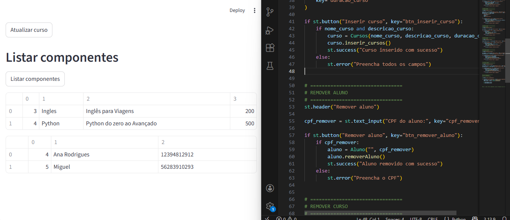

Sistema de Gerenciamento de Cursos e Alunos

Este projeto é um sistema desenvolvido em Python com o objetivo de gerenciar cursos e alunos de forma simples e organizada. Ele foi criado como parte dos meus estudos em programação, focando na prática de lógica, orientação a objetos, integração com banco de dados e interface básica.

Funcionalidades

Cadastro de cursos

Listagem de cursos cadastrados

Atualização de cursos

Remoção de cursos

Cadastro de alunos

Listagem de alunos

Remoção de alunos por CPF

Integração com banco de dados

Interface simples para interação com o usuário

Tecnologias utilizadas

Python

SQLite

Streamlit

Programação Orientada a Objetos

Objetivo do projeto

O principal objetivo deste projeto foi colocar em prática conceitos aprendidos durante os estudos, como:

Organização de código

Classes e métodos

Conexão com banco de dados

Operações CRUD

Estruturação de um sistema funcional

Além disso, o projeto serve como base para futuras melhorias e evolução conforme novos conhecimentos forem adquiridos.

Como executar o projeto

Clone o repositório:

git clone https://github.com/RafaelaDesousa33/sistema_cursos

Acesse a pasta do projeto:

cd sistema_cursos

Instale as dependências necessárias:

pip install streamlit

Execute a aplicação:

streamlit run app.py

Melhorias futuras

Validações mais completas de dados

Edição de alunos

Melhor organização da interface

Implementação de autenticação

Refatoração e otimização do código

Este projeto faz parte do meu processo de aprendizado e evolução na área de desenvolvimento de software.
Sugestões de melhorias, feedbacks e contribuições são muito bem-vindos.
